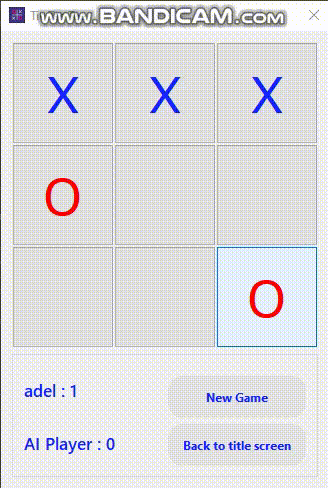

<!--
This README is a slimmed down version of the original one.
Removed sections:
- Screenshots
- Running Test
- Deployment
- FAQ
-->

<div align="center">

  
  <h1>Advanced Tic Tac Toe Game</h1>
  
  <!-- Table of Contents -->
# :notebook_with_decorative_cover: Project Overview                                                          
  Develop an advanced version of Tic Tac Toe game that incorporates user authentication,
personalized game history, and an intelligent (Artificial Intelligent) AI opponent. The game will
support both player-vs-player and player-vs-AI modes, allowing users to log in, track their game
history, and analyze past games. The project will employ best practices in software
engineering, including secure user management, rigorous testing, and professional version
control workflows.
  
<!-- Badges -->
<p>
  <a href="https://github.com/Michael-lhany/TIC-TAC-TOE/graphs/contributors">
    
  </a>
  <a href="">
    
  </a>
  <a href="https://github.com/Michael-lhany/TIC-TAC-TOE/network/members">
    
  </a>
  <a href="https://github.com/Michael-lhany/TIC-TAC-TOE/stargazers">
    
  </a>
  <a href="https://github.com/Michael-lhany/TIC-TAC-TOE/issues/">
    
  </a>
  <a href="https://github.com/Michael-lhany/TIC-TAC-TOE/master/LICENSE">
    
  </a>
</p>
   
<h4>
    <a href="https://github.com/Michael-lhany/TIC-TAC-TOE/overview.gif">View Demo</a>
  <span> · </span>
    <a href="https://github.com/Michael-lhany/TIC-TAC-TOE/TicTacToe SRS.doc">Documentation</a>
  <span> · </span>
    <a href="https://github.com/Michael-lhany/TIC-TAC-TOE/issues/">Report Bug</a>
  <span> · </span>
    <a href="https://github.com/Michael-lhany/TIC-TAC-TOE/issues/">Request Feature</a>
  </h4>
</div>

<br />

<!-- Table of Contents -->
# :notebook_with_decorative_cover: Table of Contents                                                                                                    
- [About the Project](#star2-about-the-project)
  * [Tech Stack](#space_invader-tech-stack)
  * [Features](#dart-features)
  * [Environment Variables](#key-environment-variables)
- [Getting Started](#toolbox-getting-started)
  * [Prerequisites](#bangbang-prerequisites)
  * [Installation](#gear-installation)
  * [Run Locally](#running-run-locally)
- [Usage](#eyes-usage)
- [Roadmap](#compass-roadmap)
- [Contributing](#wave-contributing)
  * [Code of Conduct](#scroll-code-of-conduct)
- [License](#warning-license)
- [Contact](#handshake-contact)
- [Acknowledgements](#gem-acknowledgements)
  

<!-- About the Project -->
## :star2: About the Project

<div align="center">
  
</div>

<!-- TechStack -->
### :space_invader: Tech Stack

<details>
  <summary>Tools</summary>
  <ul>
    <li><a href="https://visualstudio.microsoft.com/">VisualStudio</a></li>
    <li><a href="https://www.jetbrains.com/clion/">CLion</a></li>
    <li><a href="https://www.qt.io/product/development-tools">GUI Framework: Qt</a></li>
    <li><a href="https://en.wikipedia.org/wiki/Google_Test">GoogleTest framework</a></li>
  </ul>
</details>

<details>
  <summary>Server</summary>
  <ul>
    <li><a href="https://github.com/">Git & Github</a></li>
  </ul>
</details>

<details>
<summary>Database</summary>
  <ul>
    <li><a href="https://www.mysql.com/">MySQL</a></li>
  </ul>
</details>

<!-- Features -->
### :dart: Features

- [Gameplay Modes:]
* Player-versus-Player (PvP): Two human players compete against each other.
* Player-versus-AI (PvAI): A single player competes against an AI opponent with strategic algorithms in addition to the option of if Ai start or not.
- User Authentication:
* Secure login and registration.
* Password hashing for secure storage.
- Personalized Game History:
* Storage and retrieval of game histories for each user.
* Ability to review and replay past games.
- Graphical User Interface (GUI):
* Intuitive interface displaying the Tic Tac Toe board.
* User-friendly screens for registration, login, and profile management.
- AI Opponent:
* AI uses the minimax algorithm for optimal moves.

<!-- Color Reference -->
### :art: Color Reference

| Color             | Hex                                                                |
| ----------------- | ------------------------------------------------------------------ |
| Primary Color |  #222831 |
| Secondary Color |  #393E46 |
| Accent Color |  #00ADB5 |
| Text Color |  #EEEEEE |


<!-- Env Variables -->
### :key: Environment Variables

To run this project, you will need to add the following environment variables to your .env file

`API_KEY`

`ANOTHER_API_KEY`

<!-- Getting Started -->
## 	:toolbox: Getting Started

<!-- Prerequisites -->
### :bangbang: Prerequisites

This project uses Yarn as package manager

```bash
 npm install --global yarn
```

<!-- Installation -->
### :gear: Installation

Install my-project with npm

```bash
  yarn install my-project
  cd my-project
```


<!-- Run Locally -->
### :running: Run Locally

Clone the project

```bash
  git clone https://github.com/Louis3797/awesome-readme-template.git
```

Go to the project directory

```bash
  cd my-project
```

Install dependencies

```bash
  yarn install
```

Start the server

```bash
  yarn start
```


<!-- Usage -->
## :eyes: Usage

Use this space to tell a little more about your project and how it can be used. Show additional screenshots, code samples, demos or link to other resources.


```javascript
import Component from 'my-project'

function App() {
  return <Component />
}
```

<!-- Roadmap -->
## :compass: Roadmap

* [x] Todo 1
* [ ] Todo 2

<!-- Contributing -->
## :wave: Contributing

<a href="https://github.com/Louis3797/awesome-readme-template/graphs/contributors">
  
</a>


Contributions are always welcome!

See `contributing.md` for ways to get started.


<!-- Code of Conduct -->
### :scroll: Code of Conduct

Please read the [Code of Conduct](https://github.com/Louis3797/awesome-readme-template/blob/master/CODE_OF_CONDUCT.md)


<!-- License -->
## :warning: License

Distributed under the no License. See LICENSE.txt for more information.


<!-- Contact -->
## :handshake: Contact

Your Name - [@twitter_handle](https://twitter.com/twitter_handle) - email@email_client.com

Project Link: [https://github.com/Louis3797/awesome-readme-template](https://github.com/Louis3797/awesome-readme-template)

<!-- Acknowledgments -->
## :gem: Acknowledgements

Use this section to mention useful resources and libraries that you have used in your projects.

 - [Shields.io](https://shields.io/)
 - [Awesome README](https://github.com/matiassingers/awesome-readme)
 - [Emoji Cheat Sheet](https://github.com/ikatyang/emoji-cheat-sheet/blob/master/README.md#travel--places)
 - [Readme Template](https://github.com/othneildrew/Best-README-Template)

